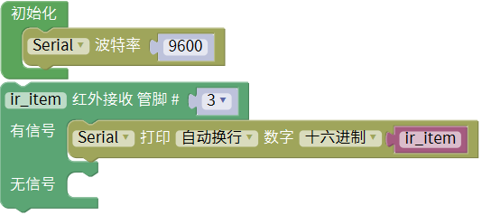
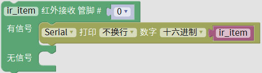

### 项目二十一 红外接收

**1.实验说明**

这一实验中，了解红外接收传感器的使用方法。红外接收传感器主要采用VS1838B红外接收传感器元件。该元件是集接收、放大、解调一体的器件，内部IC就已经完成了解调，输出的就是数字信号。它可接收标准38KHz调制的遥控器信号。

实验中，利用红外接收传感器接收外部红外发射设备发射的红外信号，并将接收信号在串口监视器上显示。

**2.实验器材**

- keyes brick 红外接收传感器*1

- keyes UNO R3开发板*1

- 传感器扩展板*1

- 3P 双头XH2.54连接线*1

- USB线*1

- JMP-1 17键 红外遥控*1

**3.接线图**

**4.测试代码**

**5.代码说明**

在找到，根据接线，把管脚设置为3。设置后，得到接收到的数据，以十六进制换行打印出来。

**6.测试结果**

按照接线图接线，上传测试代码成功，利用USB线上电后，打开串口监视器，里面就会显示红外接收传感器接收到的数据。

找到红外遥控器，拔出绝缘片，对准红外接收传感器的接收头按下按键。接收到信号后，红外接收传感器上的D1也开始闪烁，串口监视器显示如下图。

