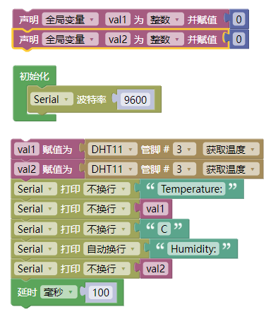
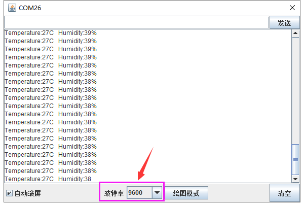

### 项目二十三 DHT11温湿度传感器检测温湿度

**1.实验说明**

在这个套件中，有一个keyes brick DHT11温湿度传感器，它主要采用DHT11温湿度传感器元件。它是一款含有已校准数字信号输出的温湿度复合传感器。它应用专用的数字模块采集技术和温湿度传感技术，确保产品具有极高的可靠性与卓越的长期稳定性。传感器包括一个电阻式感湿元件和一个NTC测温元件，并与一个高性能8位单片机相连接。因此该产品具有品质卓越、超快响应、抗干扰能力强、性价比极高等优点。

实验中，利用这个传感器测试当前环境中的温湿度，并且在串口监视器上显示测试结果。

**2.实验器材**

- keyes brick DHT11温湿度传感器*1

- keyes UNO R3开发板*1

- 传感器扩展板*1

- 3P双头XH2.54连接线*1

- USB线*1

**3.接线图**

**4.测试代码**

**5.代码说明**

1.在库文件的单元内，找到以下元件。

2. 把管脚设置为3，选择获取温度和获取湿度。
3. 设置两个小数变量，分别为val1和val2，将所测结果赋值给val1和val2。
4. 串口监视器显示val1和val2的值，显示前需设置波特率（默认设置为9600，可更改）。
5. 显示时，在数据后面添加单位。如果温度单位直接设置为℃，测试结果会出现乱码，所以我们直接用C代替℃；湿度单位直接设置为%。

**6.测试结果**

上传测试代码成功，利用USB线上电后，打开串口监视器，设置波特率为9600。串口监视器显示当前环境中的温湿度数据，如下图。

