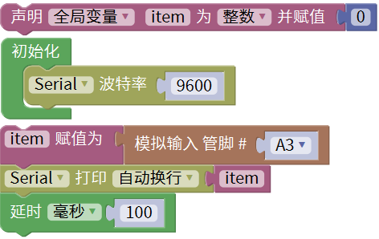
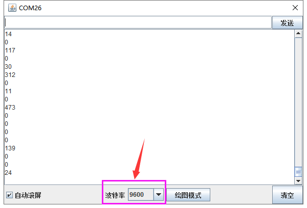

### 项目二十七 麦克风声音传感器检测声音大小

**1.实验说明**

在这个套件中，有一个keyes brick麦克风声音传感器，它主要采用一个高感度麦克风元件和LM386芯片。高感度麦克风元件用于检测外界的声音。利用LM386芯片搭建合适的电路，对高感度麦克风检测到的声音进行放大，最大倍数为200倍。使用时可以通过旋转传感器上电位器，调节声音的放大倍数。调节时，顺时针调节电位器到尽头，放大倍数最大。

实验中，利用这个传感器测试当前环境中的声音大小对应的模拟值，声音越大，模拟值越大；并且在串口监视器上显示测试结果。

**2.实验器材**

- keyes brick 麦克风声音传感器*1

- keyes UNO R3开发板*1

- 传感器扩展板*1

- 3P双头XH2.54连接线*1

- USB线*1

**3.接线图**

**4.测试代码**

**5.代码说明**

在单元内，找到以下元件。

**6.测试结果**

上传测试代码成功，利用USB线上电后，打开串口监视器，设置波特率为9600。串口监视器显示对应模拟值。实验中，我们顺时针旋转电位器和对准MIC头大声说话，可以看到模拟值数据变大，如下图。

