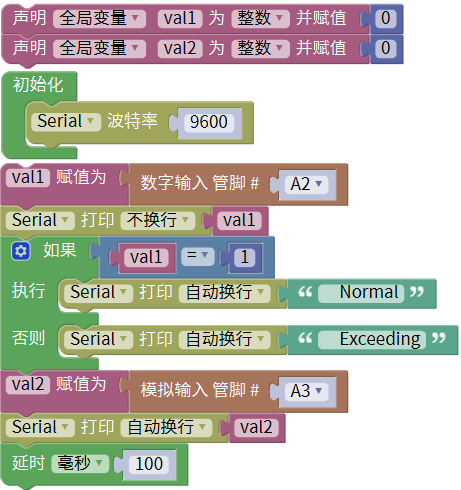
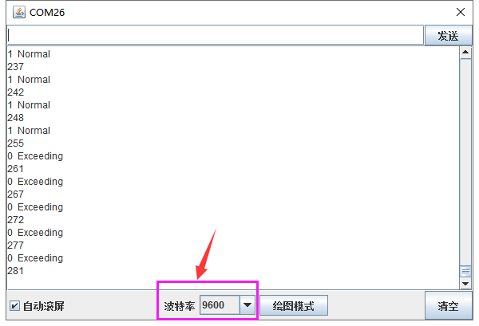

### 项目二十八 MQ-2 烟雾传感器

**1.实验说明**

在这个套件中，有一个keyes brick MQ-2 烟雾传感器，它主要用到了MQ-2可燃气体、烟雾传感器元件。该元件所使用的气敏材料是在清洁空气中电导率较低的二氧化锡(SnO2)。当传感器所处环境中存在可燃气体时，传感器的电导率随空气中可燃气体浓度的增加而增大。该传感器对液化气、丙烷、氢气的灵敏度高，对天然气和其它可燃蒸汽的检测也很理想。它可检测多种可燃性气体，是一款适合多种应用的低成本传感器。

使用时，A0端读取对应气体的模拟值；D0端连接一个LM393芯片（比较器），可以通过电位器调节测量气体报警临界点，在D0输出数字值。当测量气体含量超过临界点时，D0端输出低电平；测量气体含量没超过临界点时，D0端输出高电平。

实验中，读取传感器A0端模拟值，和D0端数字值，判断空气中测量气体的含量，以及它们是否超标。

**2.实验器材**

- keyes brick MQ-2 烟雾传感器*1

- keyes UNO R3开发板*1

- 传感器扩展板*1

- 4P 双头XH2.54连接线*1

- USB线*1

**3.接线图**

**4.测试代码**

**5.代码说明**

1. 在单元内，找到以下元件。

2. 把管脚设置为A2，管脚设置为A3。
3. 根据A2管脚高低电平，设置串口监视器输出不同字符。
4. 根据接线，读取模拟口A3的模拟值，并将测试结果只是串口监视器上显示。

**6.测试结果**

上传测试代码成功，利用USB线上电后，打开串口监视器，设置波特率为9600。串口监视器显示对应数据和字符。实验中，我们可以看到当测试的模拟值小于等于255时，气体含量没有超过临界点；当测试的模拟值大于等于261时，气体含量超过临界点；那么就代表气体含量临界点对于的模拟值在255-261之间，可以通过旋转传感器上电位器，调节临界点。

