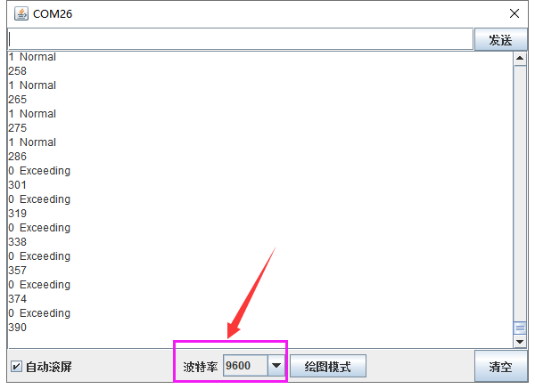

### 项目二十九 MQ-3 酒精传感器

**1.实验说明**

在这个套件中，有一个keyes brick MQ-3 酒精传感器，它主要用到了MQ-3酒精、乙醇蒸汽传感器元件。该元件所使用的气敏材料是在清洁空气中电导率较低的二氧化锡(SnO2)。当传感器所处环境中存在酒精蒸汽时，传感器的电导率随空气中酒精蒸汽浓度的增加而增大。

使用时，A0端读取对应酒精蒸汽的模拟值；D0端连接一个LM393芯片（比较器），通过电位器调节测量酒精蒸汽报警临界点，在D0输出数字值。当测量酒精蒸汽含量超过临界点时，D0端输出低电平；测量酒精蒸汽含量没超过临界点时，D0端输出高电平。

实验中，读取传感器A0端模拟值，和D0端数字值，判断空气中酒精蒸汽的含量，以及它们是否超标。

**2.实验器材**

- keyes brick MQ-3 酒精传感器*1

- keyes UNO R3开发板*1

- 传感器扩展板*1

- 4P双头XH2.54连接线*1

- USB线*1

**3.接线图**

**4.测试代码**

 

**5.代码说明**

在单元内，找到以下元件。

**6.测试结果**

上传测试代码成功，利用USB线上电后，打开串口监视器，设置波特率为9600。串口监视器显示对应数据和字符。实验中，可以看到当测试的模拟值小于等于286时，酒精蒸汽含量没有超过临界点；当测试的模拟值大于等于301时，酒精蒸汽含量超过临界点；那么就代表酒精蒸汽含量临界点对于的模拟值在286-301之间，可以通过旋转传感器上电位器，调节临界点。

