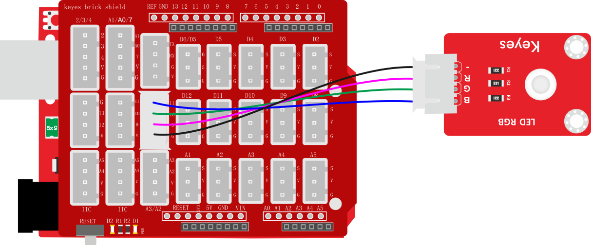
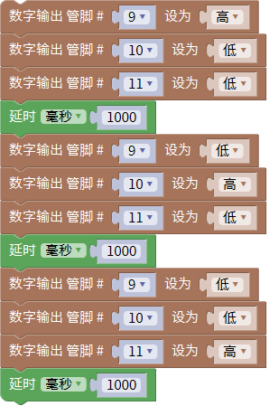
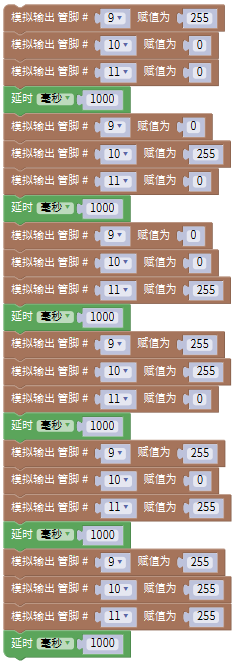

### 项目三 插件RGB模块调节LED颜色

**1.实验说明**

在这个套件中，有一个插件RGB模块，它采用F5-全彩RGB雾状共阴LED元件。控制时，将模块R G B连接单片机PWM口，-接GND。通过调节3个PWM值，控制LED元件显示红光、绿光和蓝光的比例，从而控制RGB模块上LED显示不同颜色灯光。当设置的PWM值越大，对应显示的颜色比例越重。理论来说，通过调节这3中颜色光的混合比例，可以模拟出所有颜色的灯光。

实验中，通过测试代码，控制模块上RGB LED显示几个常用颜色。

**2.实验器材**

- keyes brick 插件RGB模块\*1

- keyes UNO R3开发板\*1

- 传感器扩展板\*1

- 4P 双头XH2.54连接线\*1

- USB线\*1

**3.接线图**

**4.测试代码**

代码1：

代码2：

**5.代码1说明**

代码1中，从，其中R G B代表控制模块上LED对应的红绿蓝3种颜色对应的端口，根据接线图我们接到了D9 D10 D11，设置为9 10 11，后面设置对应高低，设置GRB LED中红绿蓝3个灯是否会亮，设置为高（对应数字口为高电平)，对应的颜色就亮。

控制模块上RGB LED显示红色1秒、绿色1秒、蓝色1秒，循环交替。

**6.代码2说明**

1. 代码2中，从中找到，其中R G B代表控制RGB LED对应的红绿蓝3种颜色对应的端口，根据接线图我们接到了D9 D10 D11，设置为9 10 11。后面设置数据代表设置模块上LED     红绿蓝颜色的比例，设置的数据越大（对应的PWM值越大)，设置该颜色的比例越大。
2. 实验中通过设置对应数值，调节RGB LED上红绿蓝颜色比例，从而控制RGB LED显示对应颜色。

**7.测试结果**

上传测试代码1成功，上电后，模块上RGB LED循环显示红绿蓝3种颜色，间隔时间为1秒。上传测试代码2成功，上电后，模块上RGB LED显示红绿蓝黄紫白6种颜色，循环不止，间隔时间为1秒。