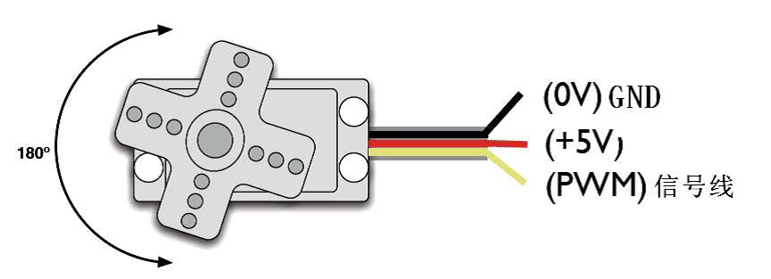
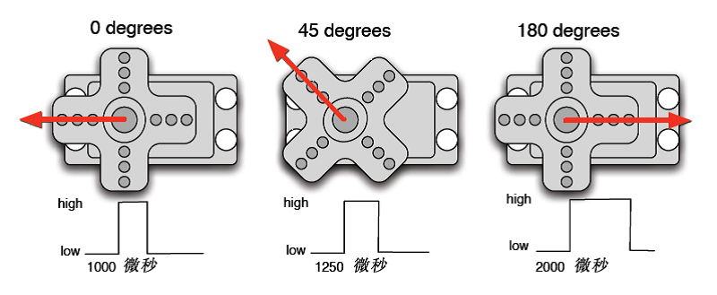
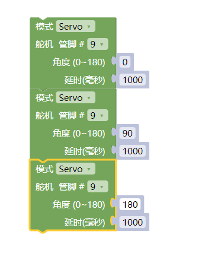
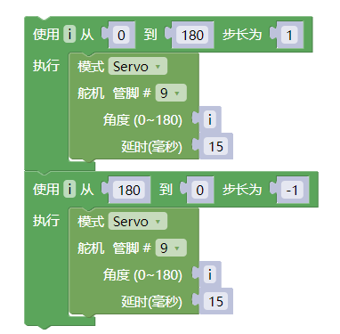
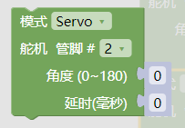
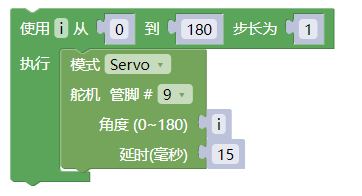

### 项目三十六 舵机控制

**1.实验说明**

舵机是一种位置伺服的驱动器，主要是由外壳、电路板、无核心马达、齿轮与位置检测器所构成。舵机有很多规格，但所有的舵机都有外接三根线，分别用棕、红、橙三种颜色进行区分，由于舵机品牌不同，颜色也会有所差异，棕色为接地线，红色为电源正极线，橙色为信号线。

舵机的转动的角度是通过调节PWM（脉冲宽度调制）信号的占空比来实现的，标准PWM（脉冲宽度调制）信号的周期固定为20ms（50Hz），理论上脉宽分布应在1ms到2ms之间，但是，事实上脉宽可由0.5ms 到2.5ms 之间，脉宽和舵机的转角0°～180°相对应。有一点值得注意的地方，由于舵机牌子不同，对于同一信号，不同牌子的舵机旋转的角度也会有所不同。

**2.实验器材**

- keyes 伺服舵机\*1

- keyes UNO R3开发板\*1

- 传感器扩展板\*1

- USB线\*1

**3.接线图**

**4测试代码**

代码1：

代码2：

**5.代码1说明**

1. 在找到，并设置管脚为9。
2. 为舵机转动的角度位置，也就是说，输入0~180的数字，舵机就转动到对应角度的位置。

**6.代码2说明**

1. 先找到并设置管脚9；
2. 在找的，范围设置为0~180，步长为1，因为我们想让舵机一度一度的转动：，加个延时15ms，不让它转动得太快。
3. ，然后又从180度转回0度。

**7.测试结果**

实验1 结果：上传测试代码成功，利用USB线上电后，舵机由0度，90度，180度三个角度来回转动。

实验2 结果：上传测试代码成功，利用USB线上电后，舵机由0~180度来回转动，并且每次转动一度。
