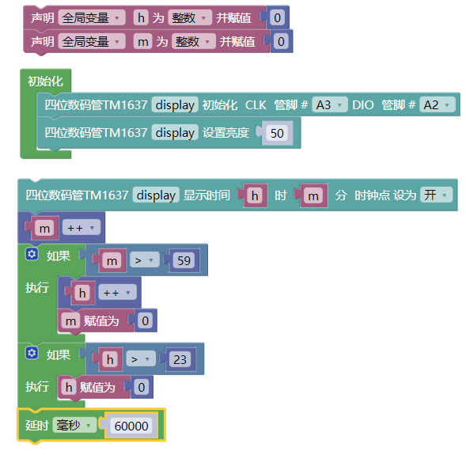
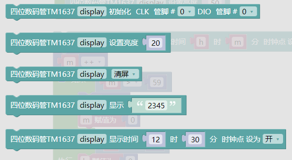
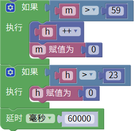

### 项目三十八 TM1637 4位数码管模块

**1.实验说明**

这个模块主要由一个0.36英寸 红色共阳4位数码管组成，它的驱动芯片是TM1637。使用时，只需要2根信号线即可使单片机控制4位8数码管，大大节约了控制板IO口资源。

实验中，利用四位数码管各显示出0~9，并加延迟为1秒。

**2.实验器材**

- keyes brick TM1637 4位数码管模块*1

- keyes UNO R3开发板*1

- 传感器扩展板*1

- 4P双头XH2.54连接线*1

- USB线*1

**3.接线图**

**4.测试代码**

**5.代码说明**

1. 在单元内，找到以下元件。

2. 在接线这种是CLK接A3，DIO接A2，所以要设置为：。
3. 亮度设置范围为0~100。
4. 当分到了60秒时，将分清0，时加1，当时到了24时，将时清0，延时60秒。

**6.测试结果**

烧录好测试代码，按照接线图连接好线,上电后，4位数码管按分刷新时间。