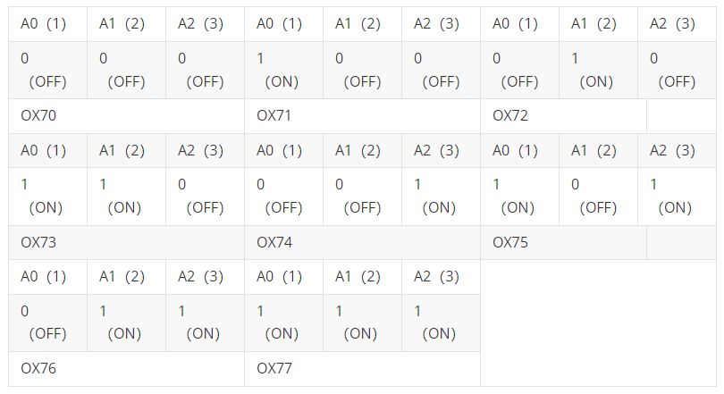
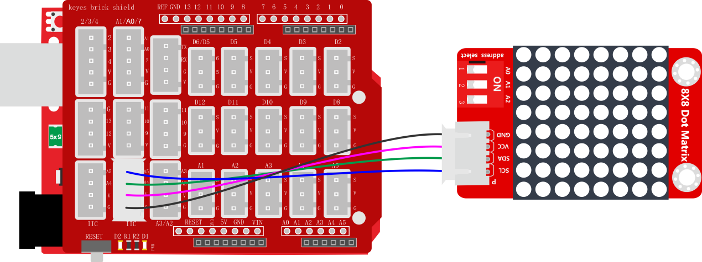
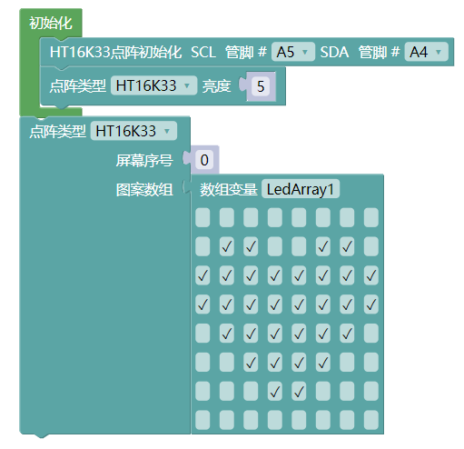
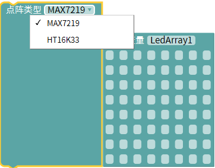
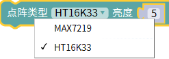

### 项目三十九 8X8点阵模块

**1.实验说明**

利用单片机驱动一个8\*8点阵时，总共需要用到16个数字口，这样就极大的浪费单片机资料。为此，特别设计了这个模块，利用HT16K33芯片驱动1个8\*8点阵，只需要利用单片机的I2C通信端口控制点阵，大大的节约了单片机资源。

模块兼容各种单片机控制板，如arduino系列单片机。使用时，可以在单片机上堆叠一个传感器扩展板。模块和自带导线连接，然后连接在传感器扩展板上，简单方便。模块上自带3个拨码开关，随意拨动开关，这I2C通信地址。设置方法如下表格。

同时，模块自带2个直径为3mm的定位孔，方便你将模块固定在其他设备。

实验中我们让点阵显示出图案。

**2.实验器材**

- keyes brick 8\*8点阵模块\*1

- keyes UNO R3开发板\*1

- 传感器扩展板\*1

- 4P双头XH2.54连接线\*1

- USB线\*1

**3.接线图**

**4.测试代码**

**5.代码说明**

1. 在中找到点阵屏，然后初始化IIC引脚。
2. 找到点阵，并把类型改为HT16K33，还可以设置亮度，范围为0~15。

**6.测试结果**

烧录好测试代码，按照接线图连接好线；上电后，点阵显示一个心形图案。