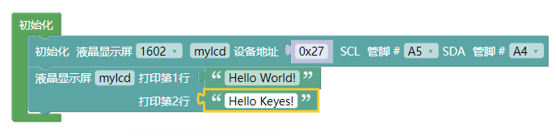

### 实验四十 IIC 1602 液晶屏

**1.实验说明**

这是一个可以显示2行，每行16个字符的液晶屏模块。液晶屏显示蓝底白字，自带I2C通信模块，使用时只需连接单片机I2C通信接口，大大节约了单片机资源。I2C通信模块上带有1个电位器，可用于调节显示屏背光，通信地址默认为0x27。

实验中让IIC 1602显示屏显示出一些字符。

**2.实验器材**

- keyes brick IIC 1602 蓝屏*1

- keyes UNO R3开发板*1

- 传感器扩展板*1

- 4P双头XH2.54连接线*1

- USB线*1

**3.接线图**

**4.测试代码**

**5.代码说明**

1. 在，中找到。

2. 在输入字符就能在1602上显示出来，每行16个字符，共两行。

**6.测试结果**

烧录好测试代码，按照接线图连接好线；上电后，显示屏两行分别显示" Hello World! "和" Hello Keyes! "字符。