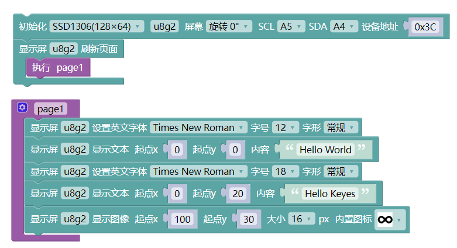
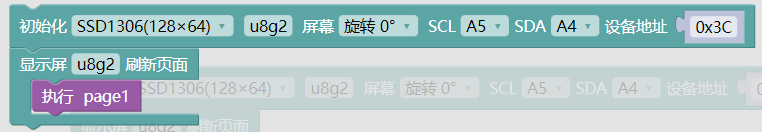
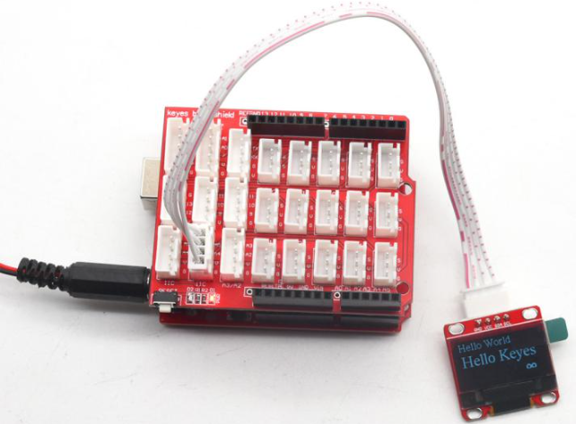

### 项目四十一 IIC OLED模块

**1.实验说明**

oled是有机发光二极管，又称为有机点激光显示。OLED显示技术具有自发光特性，它采用非常薄的有机材料涂层和玻璃基板，当有电流通过时，这些有机材料就会发光。OLED显示屏可视角度大、功耗低。OLED同时具备自发光、不需背光源（只上电是不会亮的，驱动程序和接线正确才会亮）、对比度高、厚度薄、视角广、反应速度快、可用于挠曲面版、使用温度范围广、结构及制程简单等优异特性。

这个模块主要用到一个0.96寸 OLED蓝屏，它是利用SSD1306驱动，利用I2C通信和单片机通信连接。模块自带4个定位孔，方便你将模块固定在其他设备。

实验中将让OLED模块显示出一些字符。

**2.实验器材**

- keyes brick IIC OLED模块\*1

- keyes UNO R3开发板\*1

- 传感器扩展板\*1

- 4P双头XH2.54连接线\*1

- USB线\*1

**3.接线图**

**4.测试代码**

**5.代码说明**

1. 在找到和，其中设置默认就行。
2. 然后往下翻找到，可以在这个模块中设置要显示的字符大小，字体格式和位置。
3. 再往下翻可以找到一些模块可以显示出图像，还可以画一些图像，画线、矩形、圆形、椭圆等等。

**6.测试结果**

上传测试代码成功，按照接线图接好线，利用USB上电后，oled显示屏显示“Hello World”“Hello Keyes”和一个自带图像：

