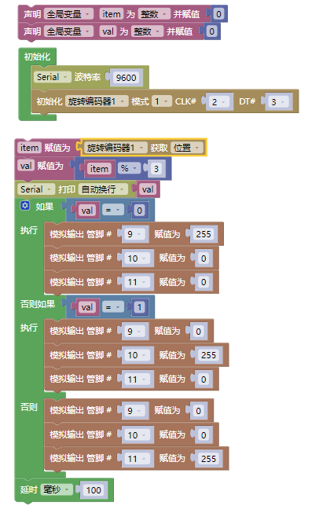
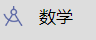
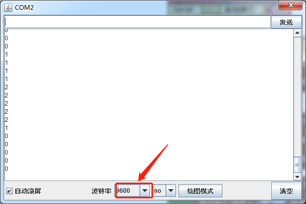

### 项目四十五 旋转编码器模块控制RGB模块

**1.实验说明**

在前面课程的项目中，利用旋转编码器计数。在这里将它扩展下，通过得出的计数，用来控制RGB模块上LED显示不同颜色。

设计代码时，需要对所得数据取绝对值。然后将数据除以3，得到余数，余数为0控制双色LED模块上LED亮红光，余数为1，双色LED模块上LED亮绿光，余数为2，双色LED模块上LED亮蓝光。

**2.实验器材**

- keyes brick 旋转编码器模块*1

- keyes UNO R3开发板*1

- keyes brick 插件RGB模块*1

- 传感器扩展板*1

- 5P双头XH2.54连接线*1

- 4P 双头XH2.54连接线*1

- USB线*1

**3.接线图**

**4.测试代码**

**5.代码说明**

1. 在，找到，将+改成%，设置，即将val1设置为val除以3的余数。
2. 得到余数后，在找到，设置管脚，根据接线设置管脚为9（红灯）、10（绿灯）和11（蓝灯)。
3. 利用余数控制模块上LED显示对应灯光颜色。

**6.测试结果**

上传测试代码成功，按照接线图接好线，上电后，打开串口监视器，设置波特率为9600。旋转编码器，串口监视器显示对应余数。即可控制外接的RGB模块上的LED的颜色（红绿蓝）。

