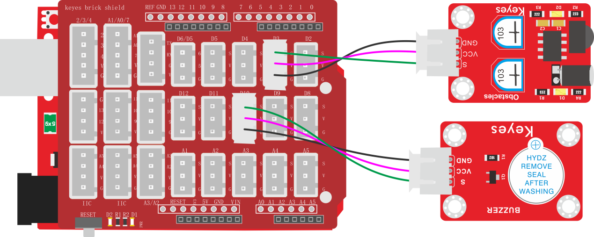

### 项目四十八 障碍物报警实验

**1.实验说明**

在上一课中，利用避障传感器检测前方障碍物，结果在串口监视器显示。在这一实验中，利用检测结果控制一个有源蜂鸣器响起。

生活中，利用一个检测传感器控制一个有源蜂鸣器响起，做报警设备，如检测磁场（霍尔传感器）、检测倾斜（倾斜模块）等等。

**2.实验器材**

- keyes brick 避障传感器*1

- keyes UNO R3开发板*1

- keyes brick 有源蜂鸣器模块*1

- 传感器扩展板*1

- 3P 双头XH2.54连接线\*2

- USB线*1

**3.接线图**

**4.测试代码**

**5.代码说明**

实验中代码将控制串口监视器显示换成了控制有源蜂鸣器的响起。

**6.测试结果**

上传测试代码成功，按照接线图接好线，上电后，检测到障碍物时，外接的有源蜂鸣器响起声音，否则有源蜂鸣器停止响起声音。