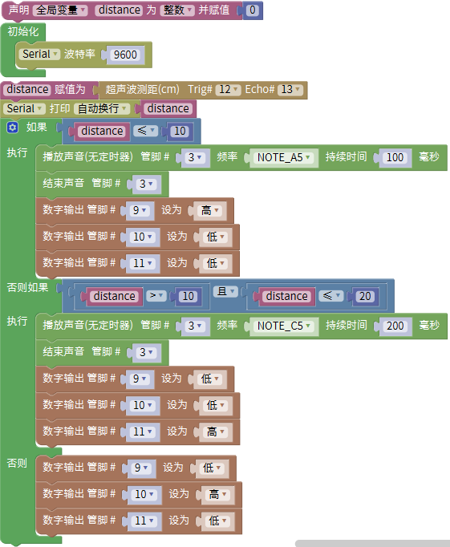
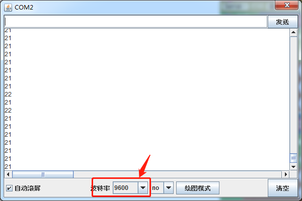

### 项目四十九 超声波雷达

**1.实验说明**

实验设置时，通过超声波传感器测试出障碍物距离。然后，利用距离大小控制无源蜂鸣器上模块上蜂鸣器响起对应频率的声音和RGB亮起对应颜色。搭建好电路后，可以人为控制超声波前方障碍物，控制检测距离，从而达到控制声音响起频率、LED灯颜色来模拟雷达效果。

**2.实验器材**

- keyes brick HC-SR04超声波传感器*1

- keyes brick 无源蜂鸣器模块*1

- keyes brick 插件RGB模块*1

- keyes UNO R3开发板*1

- 传感器扩展板*1

- 3P 双头XH2.54连接线*1

- 4P 双头XH2.54连接线\*2

- USB线*1

**3.接线图**

**4.测试代码**

**5.代码说明**

1.  设置时，我们通过调节不同距离范围，设置声音频率和灯光颜色，具体声音频率我们可以点击米思齐软件的处看到。

2.  为方便控制障碍物距离，我们可以在上面代码中，根据实际情况，在控制逻辑里调节距离范围。

**6.测试结果**

上传测试代码成功，按照接线图接好线，上电后，打开串口监视器，设置波特率为9600.检测到障碍物不同距离时，外接无源蜂鸣器模块上蜂鸣器响起不同频率的声音RGB亮起不同的颜色。

