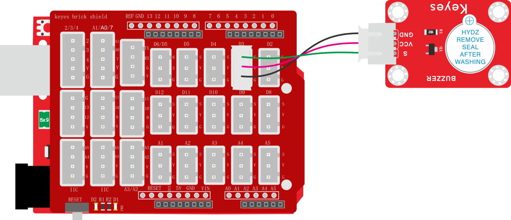

### 项目五 有源蜂鸣器模块播放声音

**1.实验说明**

在这个套件中，包含一个有源蜂鸣器模块，一个无源蜂鸣器模块。这个实验中，控制有源蜂鸣器发出声音。有源蜂鸣器元件内部自带震荡电路，控制时，在蜂鸣器元件正极输入5V电源，负极接地，蜂鸣器就自动响起。在这个模块上我们在GND VCC输入5V电源；S信号端设置为高电平时，模块上蜂鸣器响起；设置为低电平时，模块上蜂鸣器没有声音。

实验中，控制这个模块上有源蜂鸣器的循环响起声音。

**2.实验器材**

- keyes brick 有源蜂鸣器模块*1

- keyes UNO R3开发板*1

- 传感器扩展板*1

- 3P双头XH2.54连接线*1

- USB线*1

**3.接线图**

**4.测试代码**

**5.代码说明**

1. 在实验中，在单元内，找到以下模块。

2. 把管脚设置为3，设置为高时，模块上有源蜂鸣器响起；设置为低时，模块上有源蜂鸣器关闭声音。

**6.测试结果**

上传测试代码成功，上电后，模块上有源蜂鸣器响起1秒，关闭1秒，循环交替。