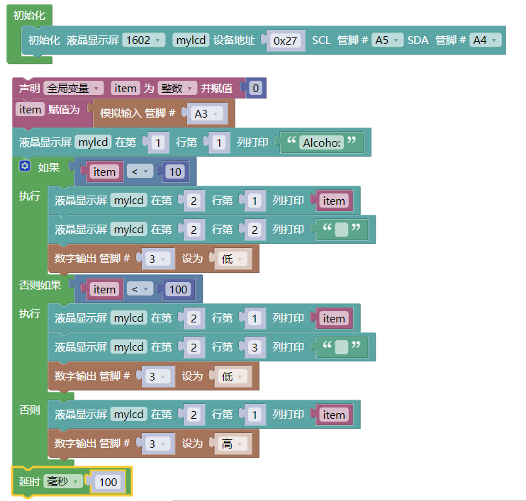
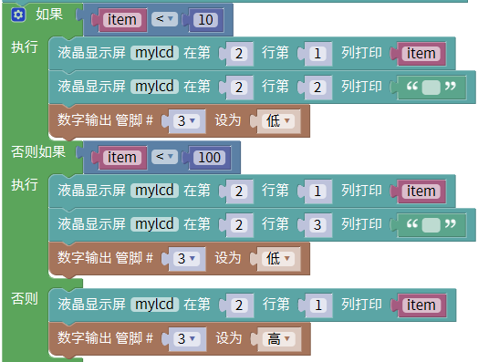

### 项目五十 酒精检测仪

**1.实验说明**

设置时，通过酒精传感器测试出酒精浓度。然后，利用浓度大小控制有源蜂鸣器报警和1602显示屏显示浓度。从而达到酒精检测仪的模拟效果。

**2.实验器材**

- keyes brick 有源蜂鸣器模块*1

- keyes UNO R3开发板*1

- keyes brick MQ-3 酒精传感器*1

- 传感器扩展板*1

- IIC 1602 蓝屏*1

- 3P双头XH2.54连接线*1

- 4P 双头XH2.54连接线\*2

- USB线*1

**3.接线图**

**4.测试代码**

**5.代码说明**

1. 在找到并初始化设置还有检测酒精浓度都跟前面讲的原理是一样的。
2. 主要讲一下这里为什么要分开显示，如果不分开显示出来值的话，最后面那位值就会保留原来的数值，不会被刷新。比如开始显示的值是100，当模拟值降到95的时候，后面的“0”还在，就会显示成“950”。

**6.测试结果**

上传测试代码成功，按照接线图接好线，上电后，检测到不同酒精浓度时，外接有源蜂鸣器模块上蜂鸣器报警，1602显示屏上第一行显示“Alcoho：”，第二行显示浓度值。