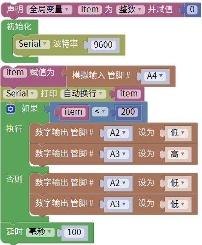
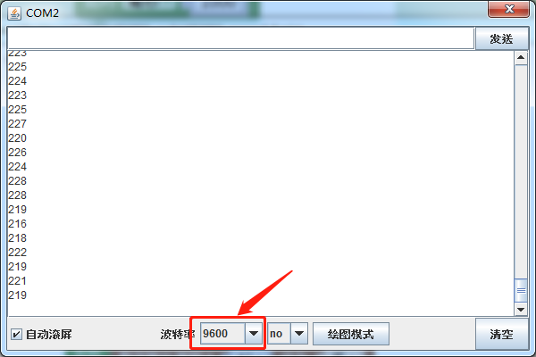

### 项目五十一 智能浇花系统

**1.实验说明**

生活中，可能由于不在家时间过长，可能导致家中的花草枯萎。所以常常想，要是能做成一个自动的智能的浇花装置就好了。

在前面学会使用土壤传感器和水泵模块，所以可以把它们结合起来做成一个智能浇花系统。当检测到土壤湿度低于某一个值时的时候，水泵开启，给花浇水直到高于所设定的阈值。这样就实现了智能浇花。

**2.实验器材**

- keyes brick 土壤传感器*1

- keyes UNO R3开发板*1

- keyes brick 电机-水泵驱动模块*1

- 传感器扩展板*1

- 3P双头XH2.54连接线*1

- 4P 双头XH2.54连接线*1

- USB线*1

- DC3-5V浇花小水泵+100MM连接线*1

- 浇花水管 内径6MM 外径8MM 1米*1

**3.接线图**

**4.测试代码**

**5.代码说明**

打开水泵：

关闭水泵：

**6.测试结果**

上传测试代码成功，按照接线图接好线，上电后，打开串口监视器，设置波特率为9600.串口监视器上打印土壤湿度值，当这个值低于200时水泵抽水，否则关闭。这个值根据实际情况去设置就行。

