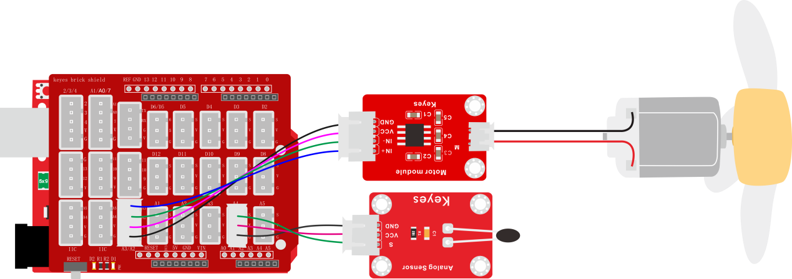
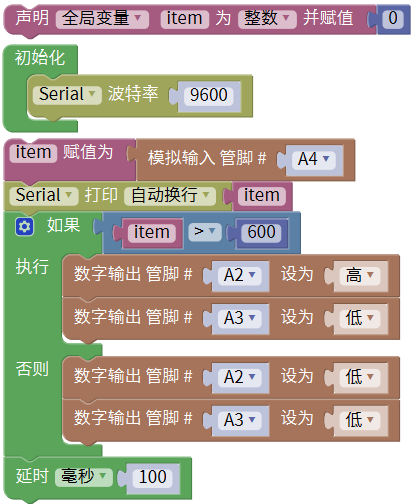
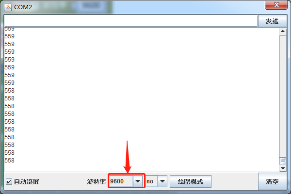

### 项目五十二 散热装置

**1.实验说明**

生活中，电脑或者电路板芯片等等经常会由于工作时间或者功耗问题而发热严重，所以常常需要一个散热装置。

在前面学会使用温度传感器和电机模块，所以这节实验可以把它们结合起来做成一个智能散热装置。当检测到环境温度高于某一个值时的时候，电机开启，从而降低环境温度，达到散热效果。

**2.实验器材**

- keyes brick 热敏电阻传感器*1

- keyes UNO R3开发板*1

- keyes brick 电机-水泵驱动模块*1

- 传感器扩展板*1

- 3P双头XH2.54连接线*1

- 4P 双头XH2.54连接线*1

- USB线*1

- 130电机+100MM连接线*1

- 电机桨*1

**3.接线图**

**4.测试代码**

**5.代码说明**

1. 在找到并接到A4。
2. 当读取的模拟值大于600时，电机开启，否则关闭。

**6.测试结果**

烧录好测试代码，按照接线图连接好线，利用USB线上电后，打开软件串口监视器，设置波特率为9600，我们可以看到对应温度的模拟值，温度度越高，模拟值越大，如下图。当这个值超过设定的值时，电机转动。

