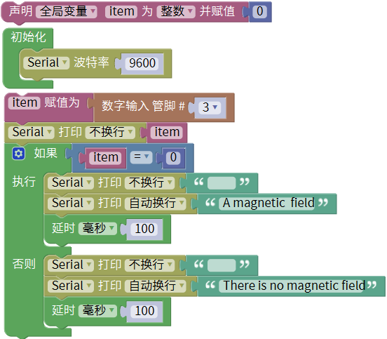
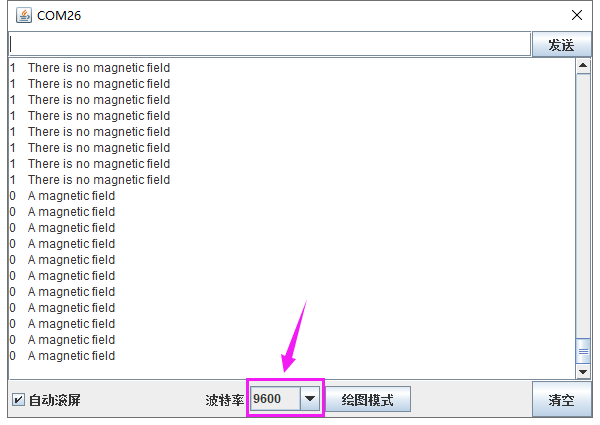

### 项目九 干簧管检测附近磁场

**1.实验说明**

在这个套件中，有一个keyes brick 干簧管模块，它主要采用MKA10110绿色磁簧元件元件。簧管是干式舌簧管的简称，是一种有触点的无源电子开关元件，具有结构简单，体积小便于控制等优点。它的外壳是一根密封的玻璃管，管中装有两个铁质的弹性簧片电板，还灌有一种惰性气体。平时，玻璃管中的两个由特殊材料制成的簧片是分开的。当有磁性物质靠近玻璃管时，在磁场磁力线的作用下，管内的两个簧片被磁化而互相吸引接触，簧片就会吸合在一起，使结点所接的电路连通。外磁力消失后，两个簧片由于本身的弹性而分开，线路也就断开了。该传感器就是利用元件这一特性，搭建电路将磁场信号转换为高低电平变换信号。

实验中，通过读取模块上S端高低电平，判断模块附近是否存在磁场；并且在串口监视器上显示测试结果。

**2.实验器材**

- keyes brick干簧管模块*1

- keyes UNO R3开发板*1

- 传感器扩展板*1

- 3P双头XH2.54连接线*1
- USB线*1

**3.接线图**

**4.测试代码**

**5.代码说明**

在实验中，在库文件的单元内，找到以下元件。

**6.测试结果**

上传测试代码成功，利用USB线上电后，打开串口监视器，设置波特率为9600。串口监视器显示对应数据和字符。实验中，当传感器检测到磁场时，item为0，串口监视器显示“A magnetic field”字符；没有检测到磁场时，item为1，串口监视器显示“There is no magnetic field”字符，如下图。

